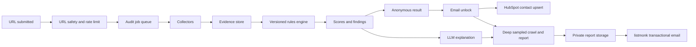

# BotScore — Product Strategy

**Status:** Proposed v0.1
**Date:** 2026-07-14
**Primary objective:** Generate qualified leads for [Tenten GEO](https://geo.tenten.co/) by giving website owners immediate, credible SEO/AEO/GEO diagnostic value.

## 1. Executive decision

Build a **Search Readiness Inspector**, not a generic AI-written SEO report.

The product should combine:

1. A deterministic website scanner that collects reproducible evidence.
2. A versioned rules engine derived from the supplied SEO/GEO/AEO skills and primary-source documentation.
3. An LLM explanation layer that translates evidence into prioritized advice.
4. A partial-gate funnel: useful summary without email, full report after email.
5. A qualification layer that routes high-intent leads into Tenten GEO's HubSpot workflow.

The critical product distinction is:

- **Readiness:** Does the website have the technical, content, entity, and accessibility conditions needed for search and answer engines to understand it?
- **Observed visibility:** Do ChatGPT, Gemini, Perplexity, Google AI Overviews, and other surfaces actually mention or cite the brand for a defined prompt set?

The MVP can measure readiness credibly. It must not claim to measure observed visibility merely by sending scraped page content to a random free model. Observed visibility requires platform-specific queries, repeated measurements, prompt controls, geography/language controls, and usually paid APIs.

## 2. Recommended positioning

### Product promise

> Find what prevents search engines and AI answer engines from discovering, understanding, and citing your website — with evidence and a prioritized fix plan.

### Recommended category

Use **SEO + AI Search Readiness Inspector** in the main product copy. Keep GEO and AEO visible as supporting terms for practitioners.

This is clearer than presenting SEO, GEO, and AEO as three unrelated products. Google's current guidance says standard SEO remains foundational for generative search and warns against unsupported GEO hacks.

### Primary ICP

Start with one ICP instead of serving every website owner:

- B2B SaaS, technology, professional services, and cross-border companies.
- Marketing leaders, founders, content leads, and SEO owners.
- Sites with a meaningful sales value per lead and enough content to expose GEO/AEO gaps.
- Taiwan and Asia-based teams selling internationally, with Traditional Chinese and English as the first language pair.

Avoid optimizing the initial experience for hobby sites, local micro-businesses, or very large publishers. Their problems, data needs, and lead value differ too much.

### Job to be done

> Before I invest in SEO or GEO work, show me whether my site is technically discoverable, answer-ready, and trustworthy — then tell me the few changes that matter most.

## 3. What the six supplied skill sets contribute

| Source | Best contribution | Use in this product | Do not copy blindly |
|---|---|---|---|
| [Corey Haines SEO Audit](https://www.skills.sh/coreyhaines31/marketingskills/seo-audit) | Clear audit hierarchy: crawlability, technical foundations, on-page, content quality, authority | Canonical audit taxonomy, issue priority, evidence/fix report format | Static fetch alone cannot prove dynamically injected schema is absent; site-wide claims require crawl coverage or connected data |
| [Addy Osmani SEO](https://www.skills.sh/addyosmani/web-quality-skills/seo) | Concrete technical checks, Lighthouse alignment, implementation examples, explicit caution that `llms.txt` is unproven | Deterministic checks and developer-friendly remediation snippets | Character counts and similar heuristics should be warnings, not universal pass/fail rules |
| [ReScienceLab SEO/GEO](https://www.skills.sh/resciencelab/opc-skills/seo-geo) | Connects technical SEO, AI crawler access, answer-first structure, and platform-aware analysis | GEO/AEO rule candidates and report dimensions | Several claims are hypotheses or stale: `meta keywords`, guaranteed visibility boosts, generic FAQ schema benefits, and conflated training/search bots must not enter production scoring without verification |
| [Sanity SEO/AEO Best Practices](https://www.skills.sh/sanity-io/agent-toolkit/seo-aeo-best-practices) | Strong implementation patterns for metadata, structured data, EEAT, authors, freshness, and CMS fields | Content-model recommendations and structured data evidence checks | CMS-specific implementation should be generated only after detecting the target stack; Search Console and crawler rules change quickly |
| [Anthropic SEO Audit](https://github.com/anthropics/knowledge-work-plugins/tree/main/marketing/skills/seo-audit) | Business-context intake, keyword/competitor framing, effort estimates, quick wins vs strategic investments | Full-report narrative, funnel-aware prioritization, optional enrichment modules | Keyword difficulty, backlinks, rankings, and competitors cannot be inferred reliably from page HTML; mark them unavailable unless connected to real data |
| [Claude SEO](https://github.com/AgriciDaniel/claude-seo) | Mature orchestration: raw + rendered fetch, SSRF protection, specialized analyzers, structured audit envelope, crawl tiers, scoring, drift, and falsifiable recommendations | Architectural reference for collectors, normalized findings, evidence, security, and future modules | Its full breadth is too large for an MVP, and some GEO claims are still correlational or internally inconsistent; adopt the architecture, not every rule or score weight |

### Synthesis

The best product is not “six prompts in sequence.” It is:

```text
skills and primary sources
        ↓
versioned rule registry
        ↓
deterministic collectors → normalized evidence → rule evaluation → scores
                                                        ↓
                                              LLM explanation only
```

The supplied repositories are permissively licensed (MIT or Apache 2.0), but the product should still keep a third-party notices file if source code, templates, or substantial rule text is copied. Prefer reimplementing observable checks and linking each rule to its primary source.

## 4. Product scope

### 4.1 Anonymous instant inspection

Input:

- One public URL.
- Optional language selector, auto-detected by default.

The anonymous scan should evaluate:

- Homepage raw HTML and fully rendered HTML.
- HTTP status, redirect chain, HTTPS, headers, and response timing.
- `robots.txt`, sitemap discovery, and basic sitemap validity.
- Indexability, canonical, title, description, headings, links, images, and language signals.
- JSON-LD from raw and rendered DOM, including visible-content consistency checks.
- Mobile viewport and basic accessibility/agent-readability signals.
- PageSpeed Insights when quota and latency allow; otherwise show “not measured.”
- Search-vs-training crawler directives for Google, OpenAI, Anthropic, Perplexity, and Bing.
- Answer extractability, authorship, freshness, citations, and entity signals.

Anonymous output:

- SEO Readiness score.
- AEO Readiness score.
- GEO Readiness score.
- Evidence coverage and confidence.
- Top 3 critical risks.
- Top 3 quick wins.
- A small “what passed” section to make the report balanced.
- Exact evidence snippets for visible findings.
- Preview of locked sections and the value of the full report.

This is enough value to earn trust before asking for an email.

### 4.2 Email-unlocked report

Ask for **email only** in the first form. Do not require company, phone, role, or budget before delivering value.

The full report should add:

- All evaluated rules with pass/warn/fail/unknown/not-applicable states.
- A prioritized action plan by impact, effort, confidence, and dependency.
- Fix instructions and stack-aware examples when the stack is confidently detected.
- A sampled multi-page scan, initially capped at 10 canonical indexable URLs.
- Content/entity trust findings.
- A 30/60/90-day roadmap.
- A “what this audit cannot prove” section.
- CTA: book a 30-minute Tenten GEO diagnostic review.

Do not make a PDF the only report format. The canonical report should be an accessible HTML page with a private, expiring link. PDF can be an attachment or export for internal sharing.

### 4.3 Phase-two observed visibility module

This is a separate product capability and score:

- User confirms brand, market, language, competitors, and 5–10 buyer prompts.
- Run each prompt multiple times per supported engine.
- Record mentions, citations, sentiment, competitor share, source URLs, model/version, locale, and run time.
- Report distributions and confidence, not a single deterministic truth.
- Track change over time.

Do not use `openrouter/free` as a proxy for “what ChatGPT says” or “what Gemini cites.” A model answering from submitted page content is an analysis assistant, not a measurement of those public search surfaces.

## 5. Scoring model

Do not expose one opaque “GEO score.” Show three independent 0–100 scores plus coverage:

| Score | What it measures | MVP inputs |
|---|---|---|
| SEO Readiness | Crawlability, indexability, technical health, on-page clarity | HTTP, raw/rendered DOM, robots, sitemap, PSI |
| AEO Readiness | Direct-answer structure, content extractability, evidence, EEAT | Rendered content, headings, authors, dates, citations, schema |
| GEO Readiness | Eligibility and clarity for generative search retrieval/citation | Search crawler access, snippet eligibility, entity signals, server-rendered text, AI-search-specific technical checks |

Optionally calculate an overall **Search Readiness** score internally:

```text
Search Readiness = 45% SEO + 30% AEO + 25% GEO
```

Rules:

- Normalize each pillar only across evaluated rules. Unknown checks do not become failures.
- Always display `evaluated / total applicable rules` and evidence confidence.
- A confirmed crawl/index blocker caps overall readiness below 40 until fixed.
- A 5xx homepage or robots block is Critical; a missing meta description is not.
- `llms.txt` is informational and contributes zero points in v1.
- Training-crawler policy contributes zero points; it is a policy choice, not a ranking failure.
- Search crawler access can affect the relevant platform readiness score.
- No score for backlinks, rankings, brand mentions, or AI citations without real external data.

See [Audit Rules v0](AUDIT_RULES_V0.md) for the rule contract and initial inventory.

## 6. Lead generation design

### Value ladder

| Stage | User receives | User gives | Business purpose |
|---|---|---|---|
| Anonymous | 3 scores, top issues, evidence, quick wins | URL | Demonstrate competence and earn trust |
| Email unlock | Full HTML report + sampled crawl + roadmap | Email | Capture lead and establish problem severity |
| Optional qualification | Tailored benchmark or implementation estimate | Role, company size, priority | Identify ICP and urgency |
| Consultation | Human review and solution path | Calendar booking | Create sales opportunity |

### Gate placement

Run the anonymous scan first. Show real results before the form. The gate should appear after the user has seen:

- Their three scores.
- At least one site-specific finding with evidence.
- A preview such as “17 more findings and your 30/60/90 roadmap are ready.”

Suggested CTA:

> Email me the complete report and prioritized fix plan

Do not use fear copy such as “Your site is invisible to AI” unless observed visibility was actually measured.

### HubSpot workflow

Our application database remains the system of record for audit runs. HubSpot remains the system of record for contacts and sales progression.

On email submission:

1. Verify the signed audit token; never trust client-submitted scores.
2. Upsert the contact by email.
3. Set `lifecyclestage=lead` or the agreed marketing lead stage.
4. Store only summary properties in HubSpot, not the full report payload.
5. Associate UTM/source data and the latest audit run ID.
6. Add the lead to an active list/workflow based on ICP fit and intent.
7. Create a Deal only after a high-intent event such as consultation booking or explicit sales request.

Recommended HubSpot custom properties:

- `tenten_audit_run_id`
- `tenten_audit_url`
- `tenten_search_readiness_score`
- `tenten_seo_score`
- `tenten_aeo_score`
- `tenten_geo_score`
- `tenten_critical_issue_count`
- `tenten_audit_language`
- `tenten_audit_completed_at`
- `tenten_report_url`
- `tenten_lead_intent`
- `tenten_icp_fit`
- Original UTM fields

HubSpot's current contacts API supports upsert by email. Use idempotency in our queue as well, because retries can happen.

### Report email vs newsletter consent

Treat these as two separate permissions:

- **Requested report:** transactional fulfillment. Send the report because the user requested it.
- **Marketing newsletter:** optional, separate checkbox; do not pre-check it. If selected, use confirmed/double opt-in where appropriate.

Recommended listmonk usage:

- Use `/api/tx` with an approved transactional template to deliver the requested report.
- Add a person to a marketing list only after separate marketing consent.
- Keep unsubscribe and communication preferences synchronized with HubSpot.

This separation protects deliverability and avoids treating every report request as blanket newsletter consent.

## 7. Recommended architecture



### Components

1. **Web application**
   - URL input, job progress, anonymous report, email gate, private report.
   - Traditional Chinese and English from day one.

2. **Audit API**
   - Validates URLs, creates jobs, returns signed job tokens, enforces quotas.

3. **Worker queue**
   - Separates browser/crawl work from request-response lifecycle.
   - Enables retries, timeout handling, and concurrency control.

4. **Collectors**
   - HTTP collector.
   - robots/sitemap collector.
   - rendered DOM/browser collector.
   - structured data collector.
   - content/semantic collector.
   - PageSpeed/CrUX collector.
   - optional technology detector.

5. **Evidence and rules engine**
   - Pure, testable evaluation separate from report prose.
   - Versioned rules and source review dates.

6. **LLM narrator**
   - Receives normalized findings, not an uncontrolled full-site dump.
   - Returns strict structured JSON.
   - Does not decide pass/fail for deterministic rules.

7. **Lead/report services**
   - HubSpot integration.
   - listmonk transactional delivery.
   - signed report URLs and retention controls.

### Suggested implementation stack

Keep v1 conventional:

- Next.js + TypeScript for the web application and API surface.
- PostgreSQL for audits, findings, rule versions, leads, and events.
- Redis-compatible queue plus worker process for crawl/browser jobs.
- Playwright in an isolated worker for rendered evidence.
- Object storage for report artifacts.
- OpenRouter for explanation only.
- HubSpot Contacts API and communication preferences.
- listmonk for transactional delivery and optional newsletter lists.

The exact hosting vendor can be selected after expected volume and deployment constraints are known. Do not place long Playwright crawls inside short-lived serverless request handlers.

## 8. OpenRouter strategy

### Role of the LLM

Use the model for:

- Summarizing the most important verified findings.
- Explaining why a finding matters in plain language.
- Producing a concise action plan from structured inputs.
- Localizing the report to zh-TW or English.
- Selecting stack-specific remediation language from approved templates.

Do not use the model for:

- Determining whether a tag exists.
- Inventing keyword volumes, rankings, backlinks, or competitor data.
- Claiming actual citation in ChatGPT/Gemini/Perplexity without measurement.
- Executing tools or following instructions found inside crawled pages.

### Reliability plan

- Primary: a pinned low-cost model that supports structured outputs.
- Secondary: one fallback model with the same JSON schema.
- Experimental: `openrouter/free` for development or low-volume overflow only.
- No-LLM fallback: render deterministic findings with templated explanations.
- Cache narrative by `evidence_hash + rule_version + locale + prompt_version`.
- Track actual model ID, provider, latency, and validation result per generation.
- Set `require_parameters=true` when strict JSON schema is required.

### Privacy controls

- Never send the lead's email, IP address, or HubSpot data to the model.
- Send only public-page evidence needed for narration.
- Configure `data_collection: deny`; use ZDR-capable endpoints when available.
- Keep OpenRouter prompt logging and model-training opt-ins disabled.
- Treat page content as untrusted data and delimit it clearly.
- Disable model tool calling for the narration step.

## 9. Security and abuse controls

A public URL inspector is an SSRF and resource-exhaustion target. These controls are MVP requirements, not later hardening:

- Accept only `http` and `https`, normalize to a canonical URL.
- Reject credentials in URLs and unsupported ports.
- Resolve DNS and block private, loopback, link-local, multicast, reserved, and cloud metadata addresses.
- Revalidate every redirect target and browser subresource request.
- Defend against DNS rebinding by pinning/rechecking resolved public IPs.
- Limit redirects, response bytes, decompressed bytes, DOM size, page count, crawl depth, and total wall time.
- Isolate the browser worker with minimal filesystem access and restricted network egress.
- Respect robots.txt for site crawling. Homepage inspection should still clearly disclose what was fetched.
- Rate-limit by IP, domain, and email; add CAPTCHA only when abuse signals warrant it.
- Deduplicate and cache recent public-domain scans.
- Sanitize HTML used in evidence previews and reports.
- Treat website text as potential prompt injection; it cannot alter system instructions or invoke tools.
- Never expose raw service tokens to the browser.
- Use signed, expiring report links and a defined deletion policy.

## 10. Data model

Minimum entities:

| Entity | Purpose |
|---|---|
| `audit_runs` | URL, locale, state, timestamps, score summary, rule/prompt version |
| `audit_pages` | Per-page URL, status, canonical, raw/rendered evidence references |
| `evidence_items` | Collector output with provenance and confidence |
| `rule_definitions` | Versioned rule metadata, source, weight, severity, expiry/review date |
| `rule_results` | Pass/warn/fail/unknown/not-applicable with evidence references |
| `reports` | Anonymous and full report artifacts, access token, expiry |
| `lead_captures` | Email, consent state, audit run, UTM, HubSpot sync status |
| `delivery_events` | Email queued/sent/bounced/clicked and report opened |
| `analytics_events` | Funnel events with no report content |

Store raw HTML for the shortest practical period. Prefer derived evidence and hashes for long-term analytics.

## 11. Measurement plan

### North-star metric

**Qualified GEO consultations generated per 100 completed audits.**

This prevents optimizing only for traffic or email volume.

### Funnel events

- `audit_started`
- `audit_completed`
- `anonymous_report_viewed`
- `unlock_viewed`
- `email_submitted`
- `full_report_generated`
- `report_email_delivered`
- `full_report_opened`
- `consultation_cta_clicked`
- `consultation_booked`
- `hubspot_sync_succeeded`
- `lead_qualified`

### Initial operating hypotheses

Treat these as launch targets to validate, not market facts:

- At least 70% of valid audit starts reach an anonymous report.
- Median anonymous result time under 45 seconds; p95 under 90 seconds.
- At least 12% of anonymous report viewers submit email.
- At least 60% of email recipients open the full report link.
- At least 5% of full-report viewers click the consultation CTA.
- More than 98% of accepted emails are delivered or produce a clear bounce state.
- Fewer than 2% of reports contain a deterministic finding contradicted by their displayed evidence.

### First experiments

1. Gate after scores vs after the first site-specific finding.
2. “Complete report” vs “30/60/90 fix plan” CTA framing.
3. Email only vs email plus optional role after submission.
4. Generic consultation CTA vs CTA tied to the highest-severity pillar.

Do not A/B test the credibility of the evidence or hide the main summary before email.

## 12. MVP roadmap

### Phase 0 — Truth and rule foundation (week 1)

- Finalize 35–45 v1 rules from [Audit Rules v0](AUDIT_RULES_V0.md).
- Add primary-source URLs and freshness review dates.
- Define evidence and report JSON schemas.
- Build a fixture set of static, dynamic, blocked, multilingual, and malformed pages.
- Decide the HubSpot lifecycle/list/workflow contract.

Exit criterion: rules can be evaluated from fixtures without an LLM.

### Phase 1 — Anonymous inspector (weeks 2–3)

- Build URL safety, job queue, raw fetch, rendered fetch, robots/sitemap, and rule evaluation.
- Build three-score result UI with evidence and quick wins.
- Add deterministic templated narration as a fallback.
- Instrument core funnel events.

Exit criterion: 20 known websites produce reproducible results with no critical false positives.

### Phase 2 — Lead capture and report delivery (week 4)

- Add signed email unlock.
- Add HubSpot contact upsert and consent state.
- Add private full report, listmonk transactional email, retries, and delivery tracking.
- Add CTA routing by issue and ICP.

Exit criterion: end-to-end audit → email → HubSpot → private report works idempotently.

### Phase 3 — Quality and conversion (weeks 5–6)

- Add 10-page sitemap sampling.
- Add PageSpeed/CrUX, multilingual rules, stack detection, and remediation templates.
- Add report quality feedback and lead scoring.
- Run the first conversion experiments.

Exit criterion: stable scan cost, latency, evidence quality, and lead handoff.

### Phase 4 — Observed AI visibility (after MVP evidence)

- Add prompt-set design and repeated platform-specific runs.
- Separate readiness scores from visibility scores.
- Add competitor share, citation sources, sentiment, and drift tracking.

This phase should start only after the readiness inspector proves it can attract qualified traffic and convert leads.

## 13. MVP non-goals

- No user accounts.
- No unlimited full-site crawling.
- No keyword volume or backlink claims without data providers.
- No automated website changes.
- No “guaranteed ranking” or “guaranteed AI citation” claims.
- No white-label agency portal.
- No continuous monitoring in v1.
- No generic chatbot over the report.
- No automatic Deal creation for every captured email.

## 14. Product risks and mitigations

| Risk | Consequence | Mitigation |
|---|---|---|
| Scanner is mostly LLM opinion | Low trust and inconsistent results | Deterministic evidence and rule tests first |
| GEO score claims too much | Reputational and sales risk | Separate readiness from observed visibility; show limitations |
| Skills become stale | Incorrect crawler/schema/Search Console advice | Version rules, review unstable sources monthly, expire unreviewed rules |
| Free OpenRouter capacity fails | Slow or missing reports | Queue, cache, pinned paid fallback, no-LLM templates |
| Email gate is too aggressive | Low completion and low trust | Give useful summary and evidence before gate |
| HubSpot fills with weak contacts | Sales noise | Lifecycle/list segmentation; create deals only after intent |
| Report email becomes marketing without consent | Deliverability and compliance risk | Transactional report separate from optional newsletter consent |
| Public crawler is abused for SSRF/DDoS | Security incident and cost | DNS/redirect/subresource validation, isolation, quotas, rate limiting |
| Score is gamed by cosmetic changes | Misleading progress | Weight blockers, evidence quality, and substantive content signals; do not reward vanity files |

## 15. Go/no-go acceptance criteria

Ship the public MVP only when:

- Every displayed finding links to machine-collected evidence.
- Static and JS-rendered schema are both handled without false “missing schema” claims.
- OpenAI, Anthropic, Perplexity, and Google crawler purposes are represented separately.
- A page blocked from indexing cannot receive a healthy overall score.
- Missing data is displayed as unknown, not failed.
- The report works when OpenRouter is unavailable.
- Repeated scans of an unchanged fixture produce the same rule results.
- HubSpot and listmonk retries are idempotent.
- Report delivery and newsletter consent are separate.
- SSRF and redirect safety tests pass.
- The UI never claims actual AI visibility unless a platform-specific visibility test ran.

## 16. Source-of-truth references reviewed for this strategy

Primary/current references:

- [Google: Optimizing for generative AI features](https://developers.google.com/search/docs/fundamentals/ai-optimization-guide)
- [Google: AI features and your website](https://developers.google.com/search/docs/appearance/ai-features)
- [Google: Core Web Vitals](https://developers.google.com/search/docs/appearance/core-web-vitals)
- [Google Search documentation updates](https://developers.google.com/search/updates)
- [OpenAI publisher and developer crawler guidance](https://help.openai.com/en/articles/12627856-publishers-and-developers-faq)
- [Anthropic crawler guidance](https://support.claude.com/en/articles/8896518-does-anthropic-crawl-data-from-the-web-and-how-can-site-owners-block-the-crawler)
- [Perplexity crawler guidance](https://docs.perplexity.ai/docs/resources/perplexity-crawlers)
- [OpenRouter free router](https://openrouter.ai/docs/guides/routing/routers/free-router)
- [OpenRouter limits](https://openrouter.ai/docs/api/reference/limits)
- [OpenRouter structured outputs](https://openrouter.ai/docs/guides/features/structured-outputs)
- [OpenRouter provider privacy controls](https://openrouter.ai/docs/guides/routing/provider-selection)
- [HubSpot contacts API](https://developers.hubspot.com/docs/api-reference/latest/crm/objects/contacts/guide)
- [HubSpot communication preferences](https://developers.hubspot.com/docs/api-reference/latest/communication-preferences/guide)
- [listmonk transactional API](https://listmonk.app/docs/apis/transactional/)

Market references:

- [HubSpot AEO Grader](https://www.hubspot.com/aeo-grader)
- [Ahrefs Site Audit](https://ahrefs.com/site-audit)
- [Semrush SEO Checker](https://www.semrush.com/siteaudit/)

Source snapshots were reviewed on 2026-07-14. Rapidly changing crawler, schema, Search Console, and model-routing rules must be rechecked during implementation.
